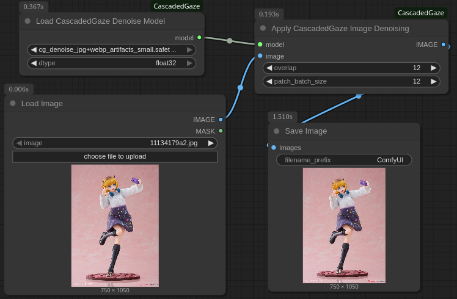
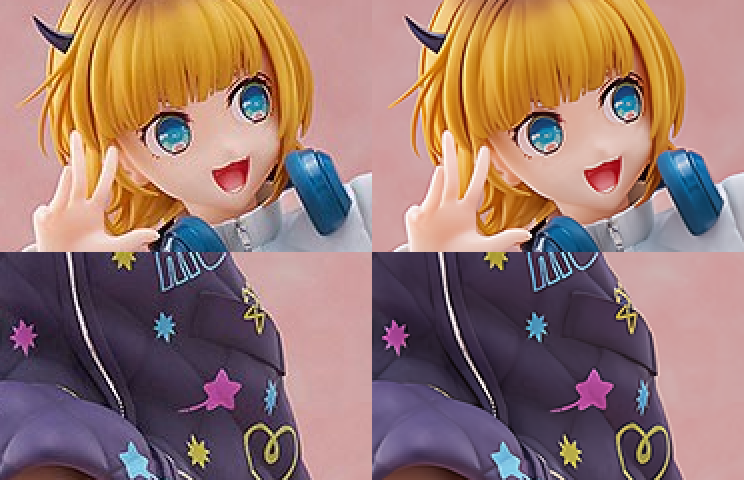

# ComfyUI-CascadedGaze

This project allows you to use CascadedGaze models within ComfyUI!

The above image demonstrates the jpg & webp artifacts removal CascadedGaze network I trained applied to an in-the-wild image taken from [1999.co.jp](https://www.1999.co.jp/eng/11134179), the patches have been 2x nearest neighbor upscaled to help demonstrate the effect. If it's still unclear to you, zoom in.

## Installation

open a terminal and cd into your ComfyUI's custom_nodes folder. Then run:
`git clone https://github.com/crimro-se/ComfyUI-CascadedGaze.git`
place models in `models/upscale_models`
you can find my models here: https://huggingface.co/Verah/Real-CascadedGaze

## Models

- [cg_denoise_jpg+webp_artifacts_small.safetensors](https://huggingface.co/Verah/Real-CascadedGaze/blob/main/cg_denoise_jpg%2Bwebp_artifacts_small.safetensors) a 77M parameter model trained to remove jpg or webp artifacts, even if they have been up or down scaled.

## What is CascadedGaze?

A traditional denoising model architecture by Ascend-Research. The official implementation repo is [here](https://github.com/Ascend-Research/CascadedGaze/tree/main) and it is MIT licensed. I've only used thier pytorch model implementation, both here and in the trainings of my models.